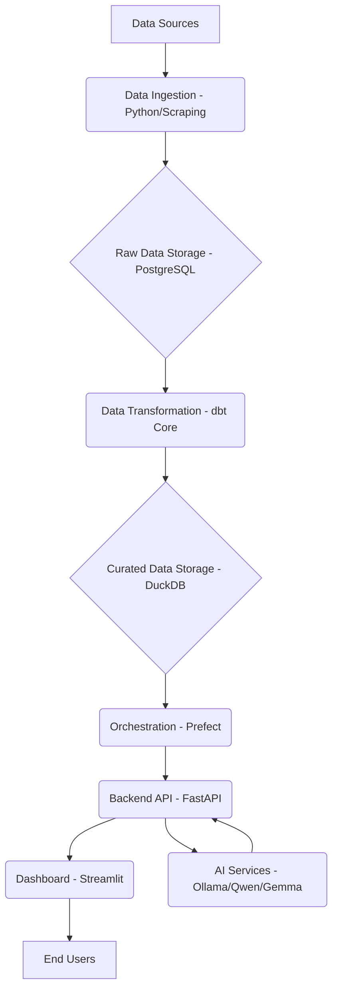

# Architecture: UAE AI & Data Job Intelligence Platform

## 1. High-Level Architecture Overview

The UAE AI & Data Job Intelligence Platform is designed with a modular and containerized approach, prioritizing scalability, maintainability, and straightforward deployment. Our architecture is fundamentally data-driven, featuring distinct layers for data ingestion, storage, transformation, orchestration, backend services, and the user interface. Crucially, all these components are orchestrated using Docker Compose, which facilitates local-first development and streamlines the entire deployment process.

## 2. Component Responsibilities

Each component within our architecture plays a specific, well-defined role:

**Data Sources** represent the external websites, job boards, and APIs from which we gather raw job market data. The **Data Ingestion (Python/Scraping)** module is tasked with collecting this raw job posting data. This involves making API calls and, where legally permissible, performing web scraping. Once ingested, this data is stored in its raw form in our **Raw Data Storage (PostgreSQL)**, a robust relational database that serves as the primary data lake for all incoming information.

Following ingestion, the **Data Transformation (dbt Core)** layer takes over. It's responsible for cleaning, structuring, and aggregating the raw data into analytical models. dbt Core allows us to define these transformations using SQL queries, ensuring both data quality and consistency. The transformed, curated data models are then stored in **Curated Data Storage (DuckDB)**, an in-process SQL OLAP database optimized for analytical queries, making it ready for consumption by the backend and dashboard.

**Orchestration (Prefect)** is central to managing our entire data pipeline workflow. It handles the scheduling of data ingestion, transformation, and AI model training tasks, while also providing essential monitoring, logging, and error handling capabilities. The **Backend API (FastAPI)** acts as a high-performance web framework, exposing data and AI services to our frontend dashboard. It processes requests from Streamlit, queries the curated data, and interacts with our **AI Services (Ollama/Qwen/Gemma)**. These AI services host and manage the large language models (LLMs) used for advanced text analysis, such as skill extraction, job role classification, and trend prediction from job descriptions, providing an API for the FastAPI backend.

Finally, the **Dashboard (Streamlit)** is our user-facing component. It offers an interactive interface for exploring job market intelligence, visualizing data, allowing for filtering, and presenting the insights generated by the platform to our **End Users**, who include Data Analysts, BI Analysts, Data Engineers, Analytics Engineers, AI Engineers, ML Engineers, Job Seekers, and Recruiters.

## 3. Communication Flows

The platform's primary communication flows are structured as follows:

1.  **Data Flow (Ingestion to Storage):** The Data Ingestion module retrieves data from various **Data Sources** and writes it into the **Raw Data Storage (PostgreSQL)**.
2.  **Data Flow (Transformation):** **Orchestration (Prefect)** initiates **Data Transformation (dbt Core)**. This process reads from **Raw Data Storage (PostgreSQL)**, processes the data, and then writes the curated models into **Curated Data Storage (DuckDB)**.
3.  **Control Flow (Orchestration):** **Orchestration (Prefect)** oversees the execution and scheduling of both the **Data Ingestion** and **Data Transformation** tasks.
4.  **API Request Flow (Dashboard to Backend):** The **Dashboard (Streamlit)** sends API requests to the **Backend API (FastAPI)** to retrieve data and insights for display.
5.  **Data Query Flow (Backend to Storage):** The **Backend API (FastAPI)** queries the **Curated Data Storage (DuckDB)** to fetch the necessary data required for user requests.
6.  **AI Service Flow (Backend to AI Services):** The **Backend API (FastAPI)** communicates with **AI Services (Ollama/Qwen/Gemma)** to perform advanced text analysis or generate predictions, either based on user queries or scheduled tasks.
7.  **Deployment & Environment Setup:** All components are containerized using Docker and managed through **Docker Compose**, which simplifies setup and ensures consistent environments across both development and deployment stages.
