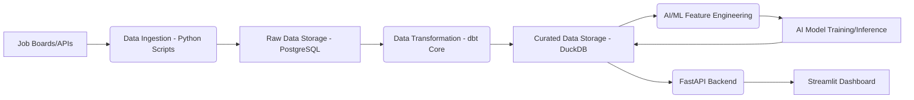

# Pipeline Design: UAE AI & Data Job Intelligence Platform

## 1. Introduction

This document outlines the design of the data pipelines for the UAE AI & Data Job Intelligence Platform. These pipelines are crucial for the continuous ingestion, transformation, and loading of job market data, ensuring both its quality and availability for analysis and intelligence generation. We will leverage Prefect for robust orchestration, dbt Core for efficient data transformations, and Docker Compose for streamlined environment management.

## 2. Overall Pipeline Flow

Our data pipeline is structured into distinct stages, systematically moving data from its raw sources to highly curated analytical models:

## 3. Pipeline Components and Responsibilities

### 3.1 Data Ingestion Layer

The primary purpose of the Data Ingestion Layer is to collect raw job posting data from various external sources. We will achieve this using Python scripts, which will utilize the `requests` library for API calls and potentially `BeautifulSoup` (or a similar tool) for web scraping, always ensuring compliance with legal and ethical guidelines. The process involves first identifying target job boards and APIs, such as LinkedIn, Indeed, or company career pages. Next, Python scripts will execute to fetch the job posting data; for APIs, this means making authenticated requests, while for scraping, it involves parsing HTML content. Following extraction, a basic cleaning step will occur, removing HTML tags from descriptions, handling encoding issues, and standardizing date formats. Finally, this extracted and lightly cleaned data will be loaded directly into the `raw_data` schema within our **PostgreSQL** database. This ingestion process will be scheduled daily, or multiple times a day, depending on the update frequency of the source and our data freshness requirements.

### 3.2 Data Storage Layer

Our data storage strategy involves two key components:

*   **Raw Data Storage (PostgreSQL):** This serves as the persistent storage for all raw, untransformed job posting data. It features a `raw_data` schema containing tables like `raw_job_postings` and `raw_companies`. Its crucial role is to act as the immutable record of ingested data and the foundational source for all subsequent dbt transformations.
*   **Curated Data Storage (DuckDB):** This component is optimized for storing our analytical data models, making them readily available for consumption by the backend and AI services. It houses an `analytics` schema with tables such as `fact_job_posting`, `dim_company`, and `dim_skill`, as defined in our `DATA_MODEL.md`. DuckDB provides fast query performance, which is essential for the Streamlit dashboard and as input for AI model training and inference.

### 3.3 Data Transformation Layer

We employ **dbt Core (Data Build Tool)** to transform our raw data into clean, structured, and aggregated analytical models. This process begins with **staging models**, which perform initial cleaning, type casting, and renaming of columns from the `raw_data` tables. Next, we build **intermediate models** to handle more complex logic, such as skill extraction, technology identification, and salary standardization. Finally, we construct the **mart models**, which are our final fact and dimension tables (e.g., `fact_job_posting`, `dim_company`), specifically optimized for analytical queries. Throughout this process, we implement **dbt tests** to ensure data integrity, uniqueness, non-null constraints, and referential integrity. The ultimate output of this layer is a set of curated data models stored in **DuckDB**.

### 3.4 Orchestration Layer

**Prefect** is our chosen technology for the Orchestration Layer, responsible for defining, scheduling, monitoring, and managing the execution of all data pipeline tasks. It comprises several key components: **Flows**, which are Python functions decorated with `@flow` that encapsulate the entire pipeline logic (e.g., `ingestion_flow`, `transformation_flow`); **Tasks**, representing individual units of work within a flow (e.g., `extract_jobs_from_api`, `load_to_postgresql`, `run_dbt_models`); and **Deployment**, where Prefect deployments will be utilized to schedule flows and manage their execution within our Docker Compose environment. Prefect offers critical features such as retries, comprehensive logging, alerting mechanisms, and robust dependency management.

### 3.5 AI/ML Integration Layer

The AI/ML Integration Layer is designed to leverage AI models for advanced data enrichment and intelligence generation. We will use **Ollama** for serving Large Language Models (LLMs) locally, specifically employing models like **Qwen 3 8B** or **Gemma**. This layer will focus on **feature engineering**, extracting valuable features such as skills, technologies, and job categories from job descriptions using LLMs. It will also facilitate **enrichment** by using LLMs to add additional attributes to job data, such as sentiment analysis from company reviews or industry classification. Furthermore, we will apply LLMs for **prediction and analysis**, including forecasting salary ranges based on job descriptions or identifying emerging skill clusters. These AI services will be exposed via the **FastAPI Backend** and can be invoked by Prefect flows or directly by the backend for real-time analysis.

## 4. Deployment and Environment Management

**Docker Compose** is central to our deployment and environment management strategy. It allows us to define and run our multi-container Docker application for both local development and deployment. Our `docker-compose.yml` file will define services for the PostgreSQL database, DuckDB (potentially as a file-based database mounted into a container or a separate service if network access is required), the Prefect server and agent, the FastAPI backend, the Streamlit dashboard, and the Ollama server for LLM serving. dbt Core will be integrated as a CLI tool, runnable within a Prefect task or a dedicated container for development. This approach ensures a **local-first development** experience, where the entire stack can be brought up with a simple `docker compose up` command, providing a consistent and reproducible development environment for all team members.
